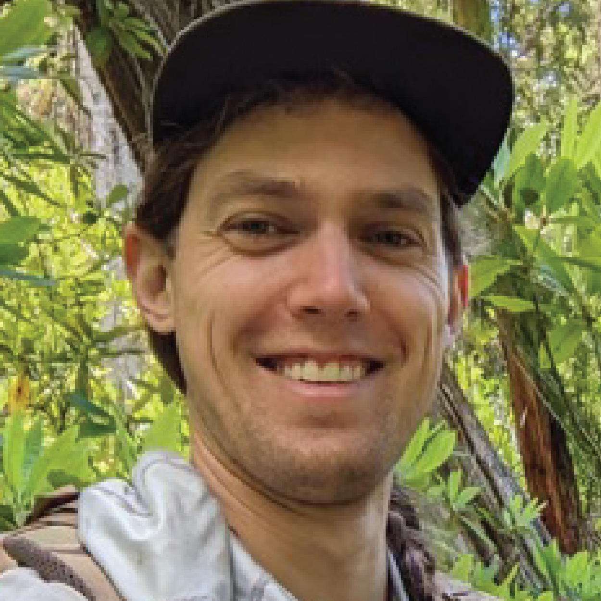
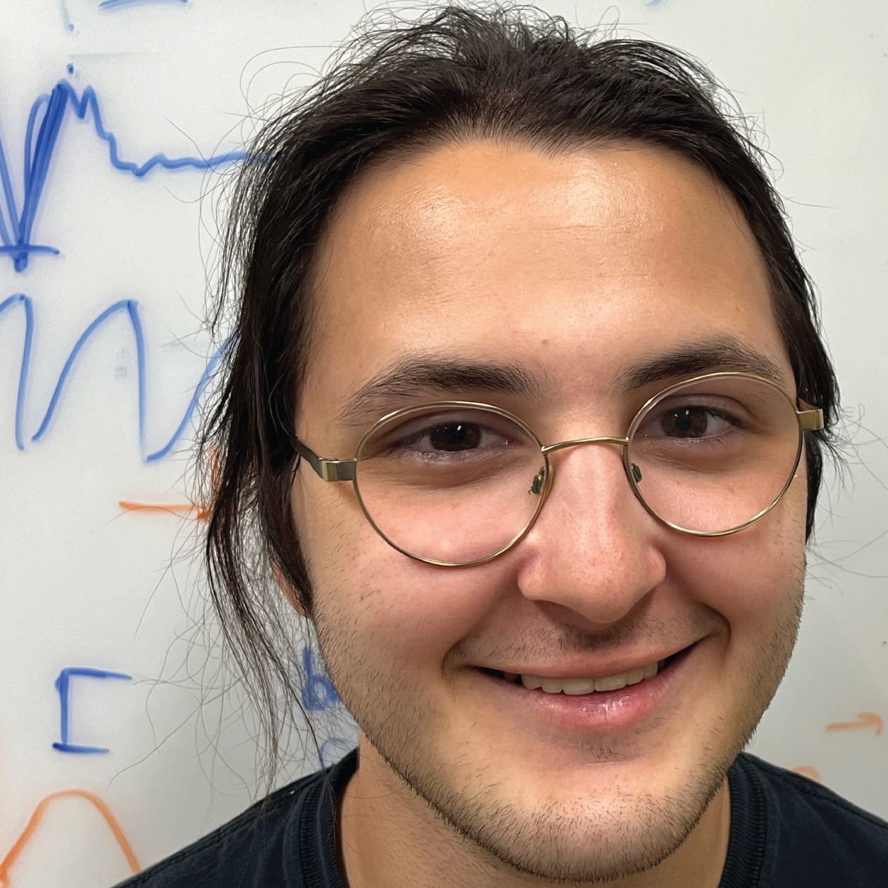
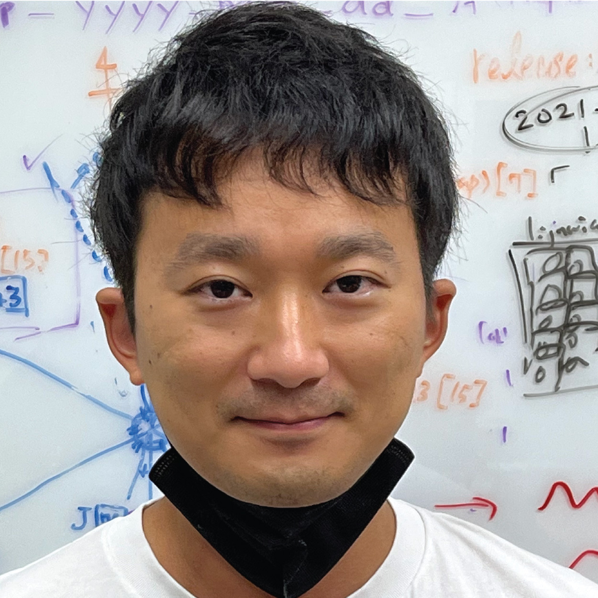
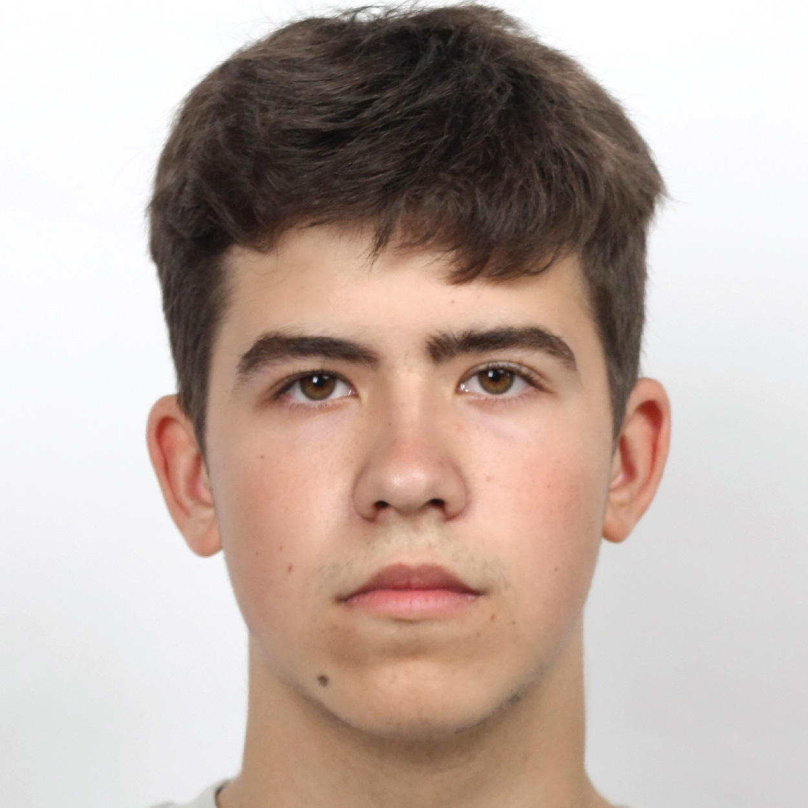
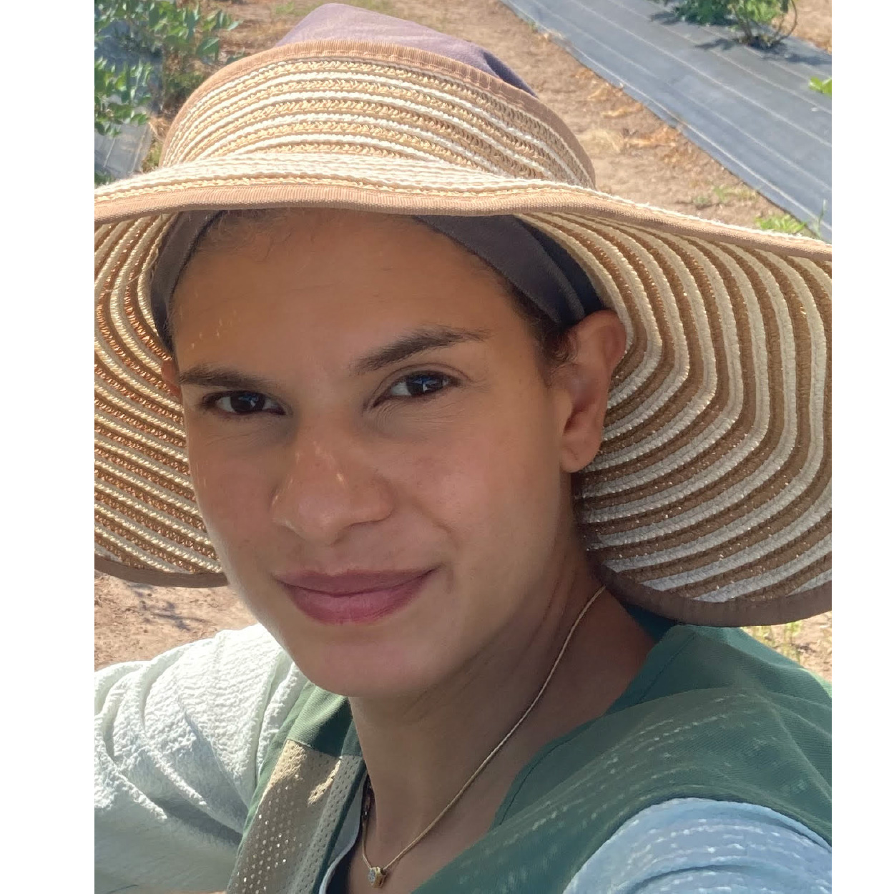

 
 
Our lab is broadly interested in mechanisms underlying complex animal behaviors, with a particular focus on how which insects move at a landscape scale &#8212; which has crucial impacts on agriculture, conservation, and human health. We strive to make precise, quantitative measurements of insect behavior in ethological contexts, both in the lab and the field. This often involves pairing custom-built imaging systems and novel computer vision analysis methods. We are using these computational approaches to study the long-distance dispersal of tiny fruit flies, including agricultural pest species. Furthermore, in tandem with ecologists and taxonomists, we are developing low-cost, open-source systems to monitor the range and movement of insect pollinators, including threatened and endangered species. 

   

### [Google Scholar](https://scholar.google.com/citations?user=uRoy8QsAAAAJ&hl=en)

### Principal Investigator
      

Timothy Warren  
tim.warren AT oregonstate.edu         

### Research Assistants
<!-- First Row -->

  

     
    <strong>Michael Getz </strong> 
    getzm AT oregonstate.edu
  

 

     
    <strong>Liam Hodge</strong> 
    hodge AT oregonstate.edu
  

 

  
 ### Graduate Students
 <!-- Second Row -->

  

     
    <strong>Nate Davidson </strong> 
    davidson AT oregonstate.edu
  

     
    <strong>Kei Horikawa</strong> 
    horikawa AT oregonstate.edu
  

 
 
 
 
 ### Undergraduate Students
 <!-- Third Row -->

  

     
    <strong>Konstantin Savkin </strong> 
    
  

 

### Alumni

     
    <strong>Dalila Rendon</strong> 

     
    <strong>Logan Rower</strong> 
 
  

 

### Mailing Address 

